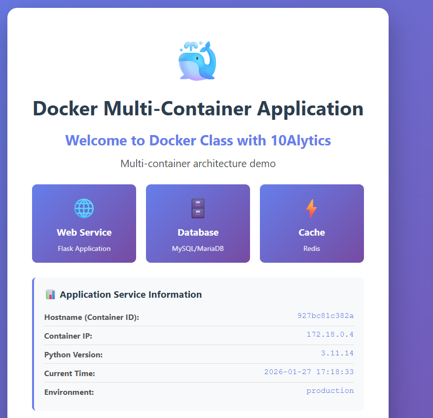
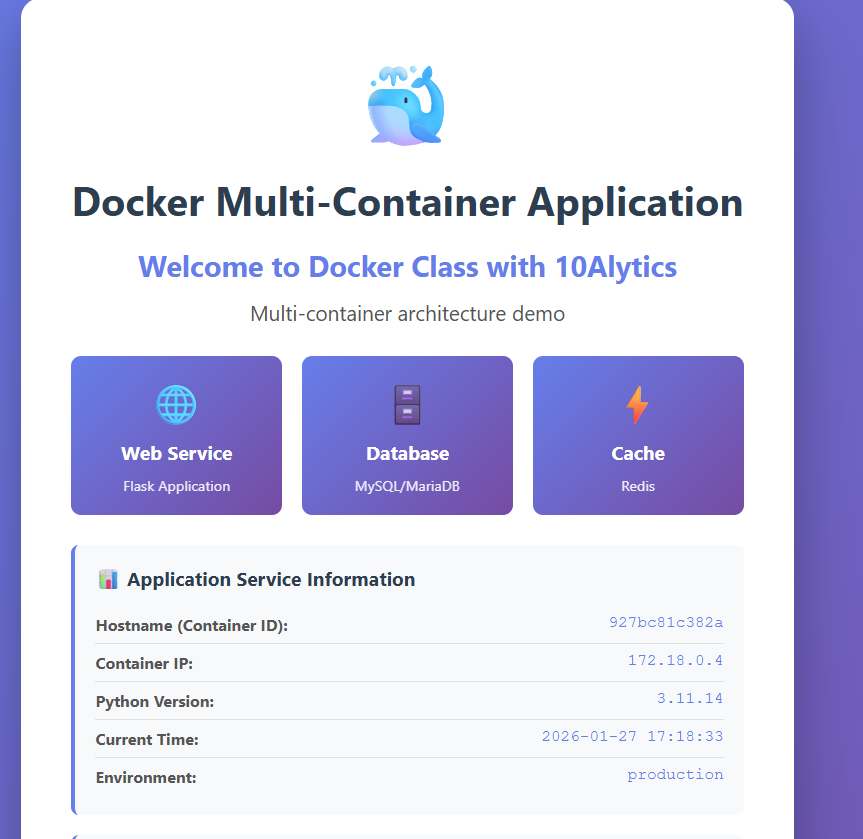
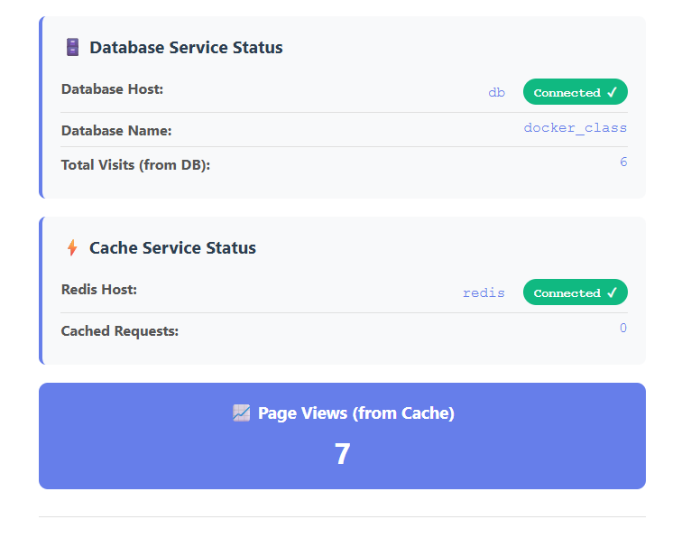
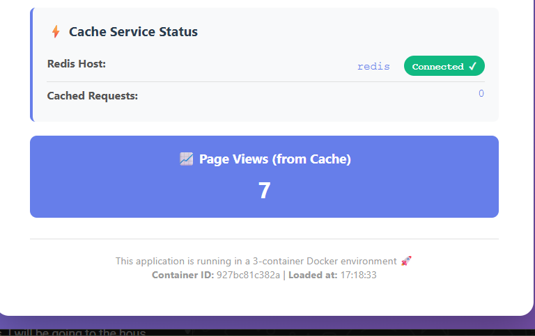

# Docker Multi-Container Application


A complete demonstration of a multi-container Docker architecture with Flask, MySQL, and Redis services.

## 🚀 Overview

This project showcases a production-ready multi-container Docker setup featuring:
- **Flask Web Application** - Python-based REST API
- **MySQL Database** - Persistent data storage
- **Redis Cache** - In-memory caching layer

## 📋 Features

- ✅ Multi-container orchestration with Docker Compose
- ✅ Health checks for all services
- ✅ Automatic service dependency management
- ✅ Database connection pooling
- ✅ Redis caching layer
- ✅ Non-root user execution (security)
- ✅ Persistent data volumes

## 🎯 Architecture

```
┌─────────────────────────────────────────┐
│     Docker Compose Network             │
├─────────────────────────────────────────┤
│                                         │
│  ┌──────────┐  ┌──────────┐  ┌──────┐ │
│  │  Flask   │  │  MySQL   │  │Redis │ │
│  │  5000    │  │  3306    │  │ 6379 │ │
│  └──────────┘  └──────────┘  └──────┘ │
│                                         │
└─────────────────────────────────────────┘
```

## 📸 Screenshots

### Application Dashboard


### Database Status


### Cache Status


### Cache Status Detail


### Page Views Counter


## 🛠️ Prerequisites

- Docker Desktop installed
- Docker Compose v2.0+
- 2GB RAM available
- Port 5000, 3306, 6379 available

## ⚡ Quick Start

### 1. Clone the Repository
```bash
git clone <repository-url>
cd sample-master
cd sample
```

### 2. Configure Environment Variables
Create/update `.env` file with the following:
```env
# Database Configuration
DB_HOST=db
DB_PORT=3306
DB_USER=root
DB_PASSWORD=root
DB_NAME=docker_class

# Redis Configuration
REDIS_HOST=redis
REDIS_PORT=6379

# Flask Configuration
FLASK_ENV=production
PORT=5000
```

### 3. Build and Start Services
```bash
# Build the Docker image
docker compose build

# Start all services
docker compose up -d

# Check service status
docker compose ps
```

### 4. Access the Application
Open your browser and navigate to:
```
http://localhost:5000
```

## 📊 Service Status

Once running, you should see:

| Service | Status | Port | Connection |
|---------|--------|------|-----------|
| Flask Web | ✅ Running | 5000 | http://localhost:5000 |
| MySQL Database | ✅ Healthy | 3306 | localhost:3306 |
| Redis Cache | ✅ Healthy | 6379 | localhost:6379 |

## 🔄 Services

### Flask Application (Port 5000)
- Web interface for the application
- REST API endpoints
- Database and cache integration
- Real-time service status monitoring

**Health Check**: HTTP GET to `/`
```bash
curl http://localhost:5000
```

### MySQL Database (Port 3306)
- Persistent data storage
- Docker container: `sample_db`
- Default credentials:
  - User: `root`
  - Password: `root`
  - Database: `docker_class`

**Health Check**: MySQL ping command
```bash
docker exec sample_db mysqladmin ping -h localhost
```

### Redis Cache (Port 6379)
- In-memory data caching
- Docker container: `sample_redis`
- No authentication required in this setup

**Health Check**: Redis ping command
```bash
docker exec sample_redis redis-cli ping
```

## 📝 Environment Variables

| Variable | Default | Description |
|----------|---------|-------------|
| DB_HOST | db | Database host (Docker service name) |
| DB_PORT | 3306 | Database port |
| DB_USER | root | Database user |
| DB_PASSWORD | root | Database password |
| DB_NAME | docker_class | Database name |
| REDIS_HOST | redis | Redis host (Docker service name) |
| REDIS_PORT | 6379 | Redis port |
| FLASK_ENV | production | Flask environment |
| PORT | 5000 | Flask port |

## 🐳 Docker Commands

### View Logs
```bash
# All services
docker compose logs

# Specific service
docker compose logs -f web
docker compose logs -f db
docker compose logs -f redis
```

### Execute Commands in Container
```bash
# Flask container
docker exec sample_web python app2.py

# MySQL container
docker exec sample_db mysql -u root -p

# Redis container
docker exec sample_redis redis-cli
```

### Stop Services
```bash
# Stop all services
docker compose down

# Stop and remove volumes
docker compose down -v
```

### Restart Services
```bash
# Restart all
docker compose restart

# Restart specific service
docker compose restart web
```

## 🔧 Troubleshooting

### Database Connection Errors
If you see `Can't connect to MySQL server on 'db:3306'`:
1. Ensure the database has time to initialize (takes ~30 seconds)
2. Check health status: `docker compose ps`
3. View logs: `docker compose logs db`

### Redis Connection Errors
If Redis connection fails:
1. Verify Redis is healthy: `docker compose ps`
2. Check logs: `docker compose logs redis`
3. Test connection: `docker exec sample_redis redis-cli ping`

### Port Already in Use
If ports are already bound:
```bash
# Change in docker-compose.yml
web:
  ports:
    - "5001:5000"  # Use 5001 instead
```

## 📁 Project Structure

```
sample/
├── app2.py                 # Flask application
├── Dockerfile              # Container image definition
├── docker-compose.yml      # Multi-container orchestration
├── requirements.txt        # Python dependencies
├── .env                    # Environment variables
├── .env.sample             # Sample environment file
├── README.md               # This file
└── readme4dockercompose.md # Additional documentation
```

## 🔒 Security Notes

- ⚠️ This is a **development setup only**
- Change default passwords in production
- Use environment-specific `.env` files
- Never commit sensitive data to version control
- Use secrets management in production (Docker Secrets, Vault, etc.)
- The app runs as non-root user (`flaskuser` UID 1000)

## 📚 Key Technologies

- **Docker**: Containerization platform
- **Docker Compose**: Multi-container orchestration
- **Flask**: Python web framework
- **MySQL 8.0**: Relational database
- **Redis**: In-memory data cache
- **Python 3.11**: Programming language

## 🎓 Learning Outcomes

This project demonstrates:
- ✅ Multi-container architecture design
- ✅ Service-to-service networking in Docker
- ✅ Health checks and dependency management
- ✅ Environment configuration management
- ✅ Data persistence with volumes
- ✅ Container security best practices

## 🤝 Contributing

1. Fork the repository
2. Create a feature branch
3. Commit your changes
4. Push to the branch
5. Create a Pull Request

## 📄 License

This project is open source and available under the MIT License.

## 📞 Support

For issues and questions:
1. Check the troubleshooting section above
2. Review Docker Compose documentation: https://docs.docker.com/compose/
3. Check Flask documentation: https://flask.palletsprojects.com/
4. View service logs: `docker compose logs`

---

**Created with ❤️ for Docker learners | 10Alytics Docker Class**
